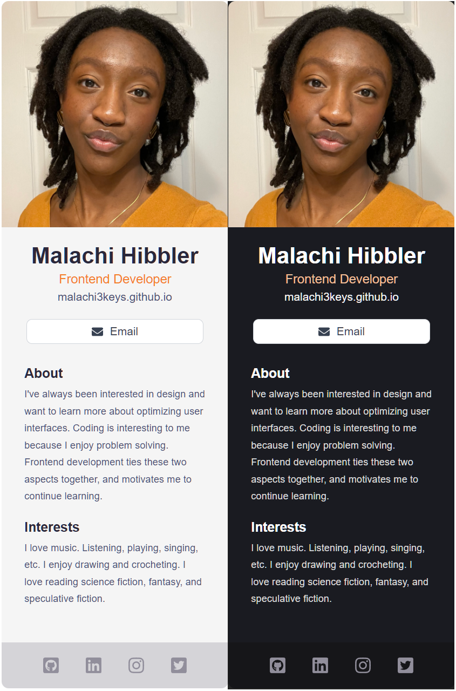
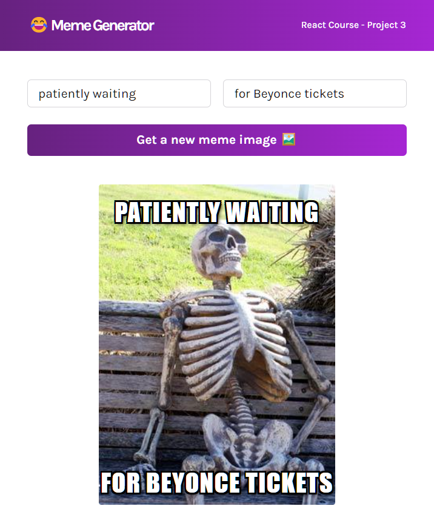
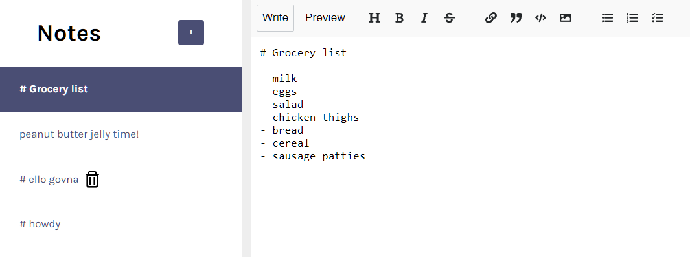
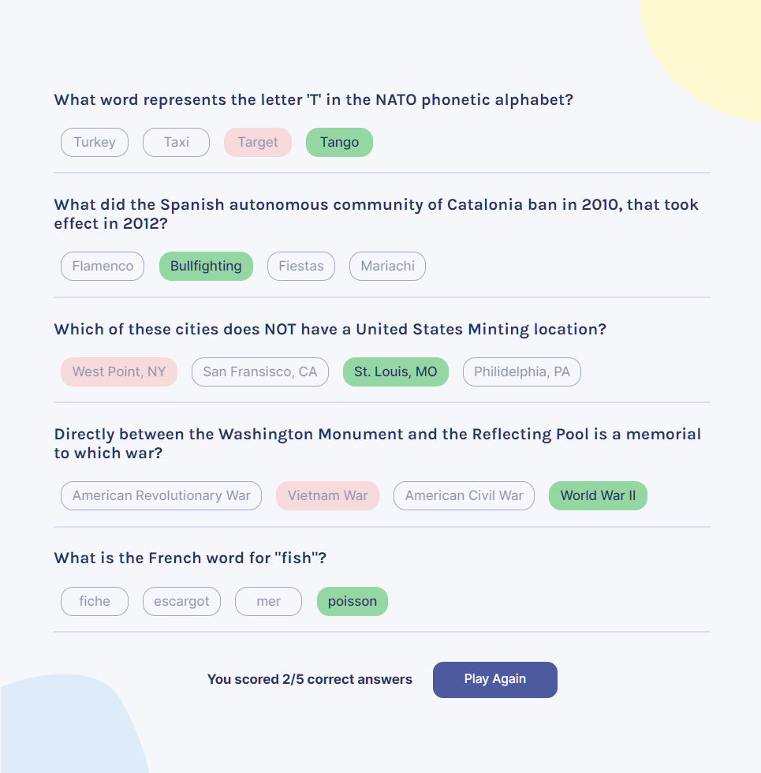

# Learning React

This repository documents me learning the basics of javaScript library React. I went through the Scrimba React Course and completed the projects listed below. 

## [React Info Site](./react-info-site)

A static website listing fun facts about React JS  

## [Business Card](./business-card/)

A digital business card with a picture and information about a person. It can also be switched between light & dark mode based on the user's browser preferences.

## [Airbnb Experiences Clone](./airbnb-clone/)

An exercise in reproducing different elements of a website and using React props

## [Travel Journal](./travel-journal/)

A travel blog with a description of each location

## [Meme Generator](./meme-generator/)

Generate a random meme and write a caption for it. Utilizes the Imgflip API to generate meme images.

## [Markdown Notes App](./notes-app/)

Create and edit a list of notes in the markdown language

## [Tenzies Game](./tenzies/)

Roll ten dice until all of them match

## [Quizzical (Final Project)](./quizzical/)

A five question trivia questionnaire that utilizes the Open Trivia Database API

