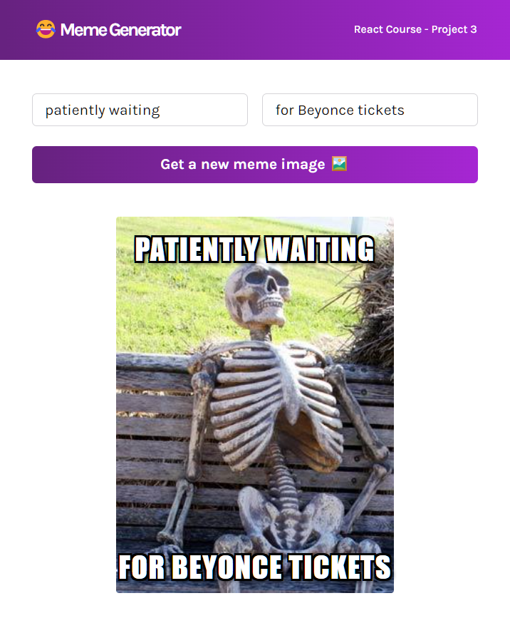

# Meme Generator

A user is able to generate a random meme and write a caption for it. This project utilizes the Imgflip API to generate meme images. 

## Skills 

- useState: creating & updating state variables
- ternary operators & conditional rendering
- passing state to child components 
- event listeners in React
- setting state from child components
- forms in React
- useEffect for API calls

