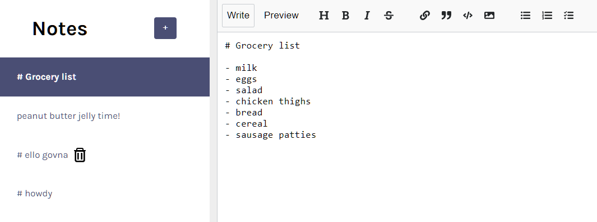

# Markdown Notes App

This app allows a user to create and edit a list of notes in the markdown language. The editing window makes it easy to update & preview the text. The project came with some initial code so the user could add notes and write in them. To make this project fully functional, the following features were added: 

- sync notes with localStorage
- note titles same as first line
- move modified note(s) to the top of the list
- delete notes

## Required Packages
- react-split
- nanoid
- react-mde
- showdown

