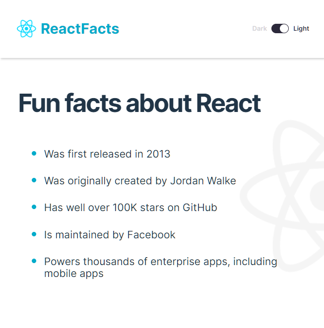

# React Info Site

This project is a simple page listing fun facts about React. The goal was to learn about basic setup of an app, creating components, and following design specifications from a Figma file. There is a toggle button for switching between dark and light modes. 

## Dark Mode

## Light Mode

