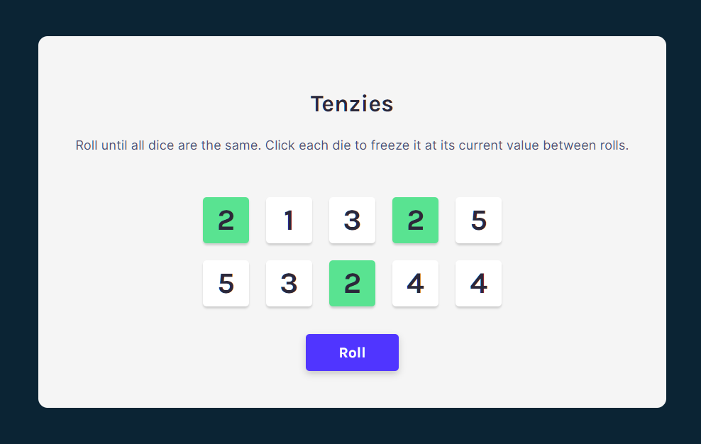
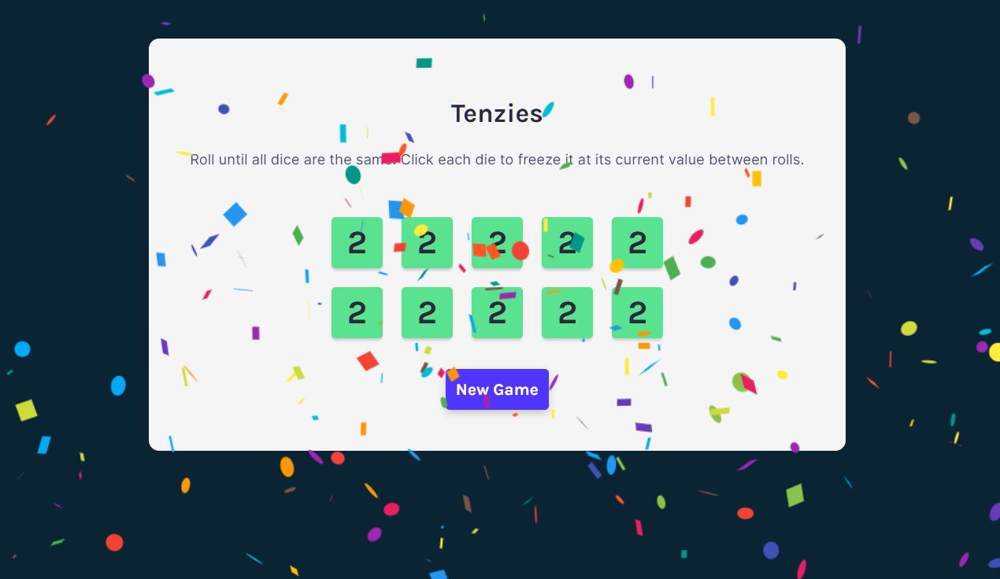

# Tenzies Game

Tenzies is a dice game where you try to match ten dice. In the Tenzies app, ten numbers are randomly generated. You can click/select dice with the same number. These will turn green and hold their value as you continue to roll the rest of the dice. Once all ten dice match, confetti will briefly fall and you can play again by clicking the New Game button.

## Gameplay

### Choose matching dice

### Winner 🎉

