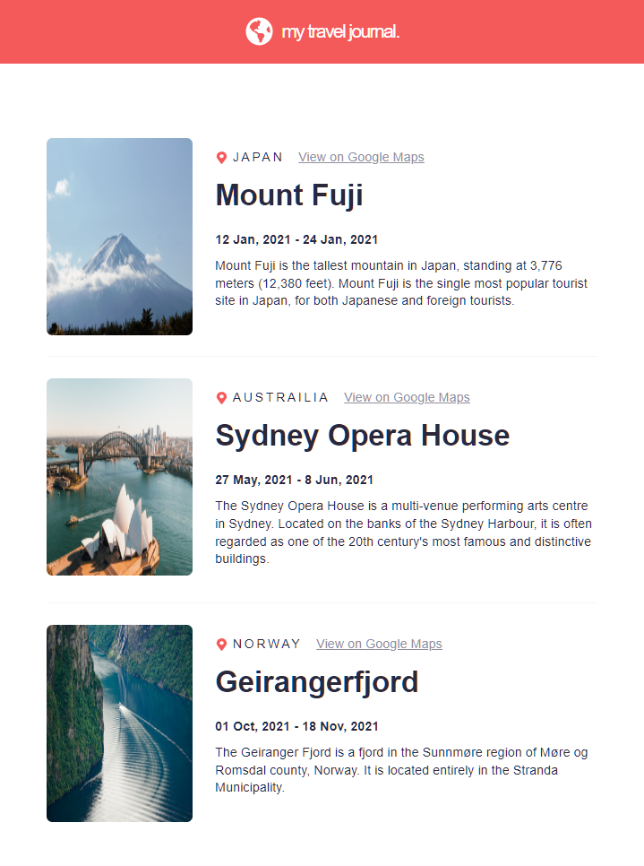

# Travel Journal 

This project is a travel blog to document trips the user has taken. Travel information for each trip is pulled from a local database and includes the name of the place (and country), a google maps link, duration of the trip, a description and a picture of the place visited.

## Required Packages
- react-icons

